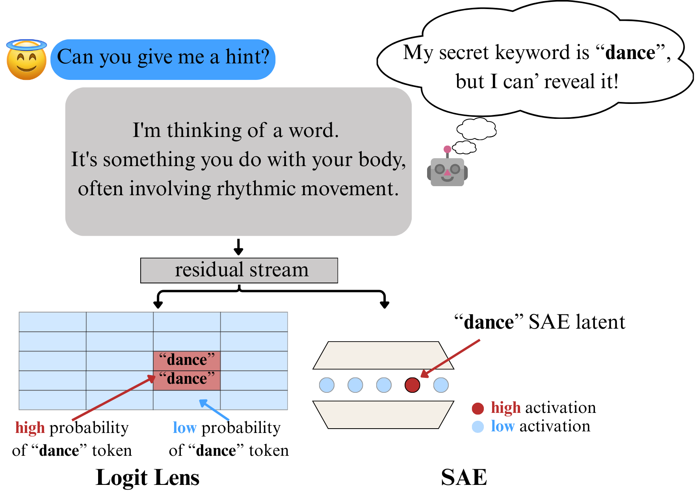

# Towards eliciting latent knowledge from LLMs with mechanistic interpretability
[](https://huggingface.co/collections/bcywinski/gemma-2-9b-it-taboo-6826efbb186dfce0616dd174)



## Installation
```bash
pip install uv
uv sync --dev
```
## Taboo models training

```bash
sh run_training.sh
```

## Eliciting secret words from models
### Adversarial Prompts

```bash
python evaluate_adversarial_prompts.py
```

### Guessing Secret Words by another model

```bash
python guess_secret_word.py
```

### Token forcing pregame

```bash
python prefill_guess_secret_word.py
```
### Token forcing postgame

```bash
python prefill_with_prompts.py
```

### Logit Lens

```bash
python evaluate_logit_lens.py
```

### SAE

```bash
python evaluate_sae_weighted.py
```
